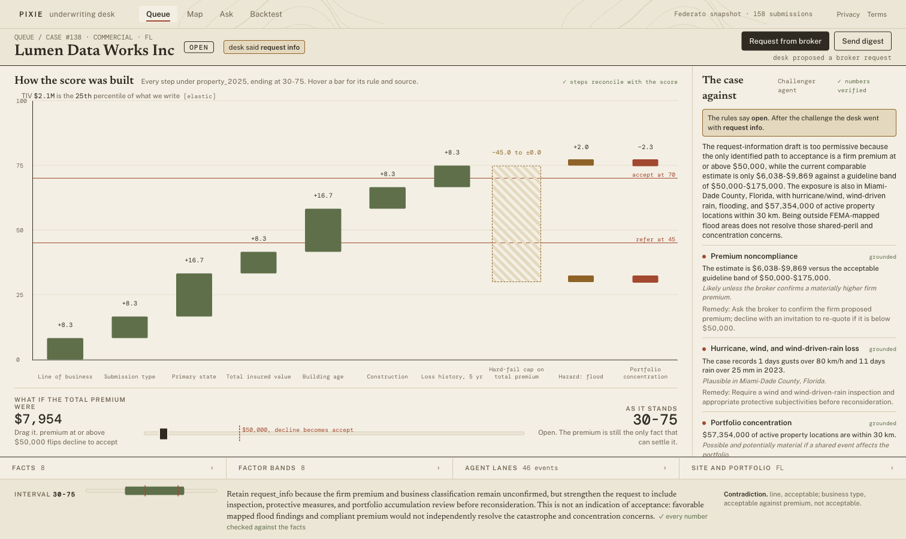
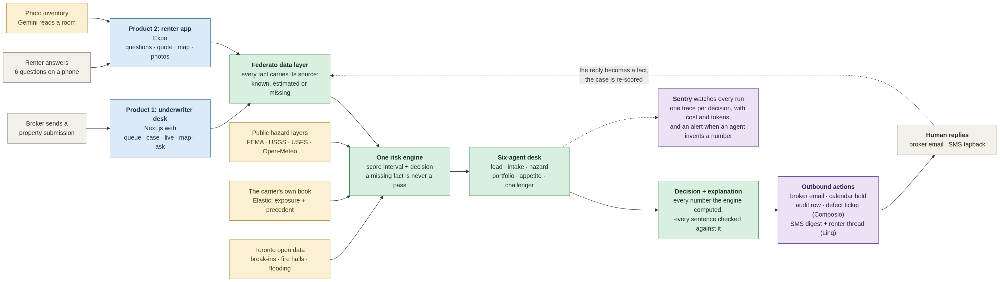

# Pixie

Pixie is an underwriting desk: a commercial property submission arrives, a deterministic engine
scores it into an interval, six agents decide what to look up and argue the case, and every number
on screen carries the place it came from. The same engine, pointed at a different rules file and a
Toronto data pack, prices a renter policy in a phone app, so a quote the model will not auto-price
lands in the same underwriter's queue.

Hack the North 2026. The product is Pixie; the repo keeps the internal name `atlas`.

## The one screenshot

`web/screenshots/main-case-138.png`. Case 138, a $2.07M property submission from Lumen Data Works
Inc. Left: how the score was built, one bar per rule under `rules/property_2025.yaml`, hover a bar
for its rule text and source, ending at the interval 30-75 with the refer band at 45 and the accept
band at 70. The hatched bar is a hard-fail cap. Below it, a what-if slider: the premium is the only
fact that can settle this case, and at $50,000 the decline flips to accept. Right: the Challenger
agent's case against the desk's own draft, each objection labelled grounded, with a remedy. At the
bottom, the Lead's decision with "every number checked against the facts" next to it.

That check is the product. The prose is written by a model; the numbers in it are not.

## Run it

`docs/RUNBOOK.md` has the verified commands, ports and the recovery steps, written against what
actually runs on the demo laptop. The short version is an API on 8000, a Next production build on
3100, and Expo on 8081. Do not duplicate the commands from here; the runbook is the one that gets
corrected.

Two things to know before you start:

- Replay is the default on `/live`. It plays a recorded run with no model calls. "Run live" does the
  real thing, about 60 seconds and $0.07 for case 138.
- `.env` sets `ATLAS_ACTIONS=live` on the demo machine, so Gmail and Linq really send. Set
  `ATLAS_ACTIONS=dry` to rehearse.

A fresh clone is missing three things that are gitignored or symlinked: `cache/layers` (350
prefetched hazard files, rebuild with `packs/us/prefetch.py`), `data/federato` (a symlink to the
pulled Federato data), and every API key. Without the layer cache, two backtest tests fail.

## Architecture

`docs/diagrams/01-overview.png`. Two products over one risk engine. `docs/ARCHITECTURE.md` has this
picture plus a module map and a single submission traced from arrival to a human reply, with file
and line references for every box.

What to read off it:

- `engine.assess()` is called by the commercial path and by the tenant path with different rules
  files. That is the whole of the code reuse claim; there is no second scorer.
- Enrichment is read from disk, never fetched during a run.
- The decision leaves the building as actions (broker email, calendar hold, audit row, defect
  ticket, an SMS digest), and the human's reply comes back in as a fact that re-scores the case.
- One Sentry span wraps each decision, carrying depth, models, verdict, interval, calls, tokens and
  cost.

The API has 46 routes, the web app has 9 pages, the phone app has 6 routes on Expo Router.

## The six invariants

`AGENTS.md` holds these. Tests enforce them, and every coding agent on the project had to obey them.

1. **No number comes from a model.** Scores, premiums, estimates, hazard factors and portfolio
   totals are computed in Python. Models plan queries, choose what to investigate, and write prose
   from values the code already produced. `verify_numbers()` string-checks every sentence a model
   writes against the facts the tools returned, and swaps in a deterministic template when a number
   does not appear there. Why: an underwriter cannot defend a price a model invented, and a
   hallucinated premium in this domain is a real loss.
2. **Missing is never a pass.** A missing field is `unknown`, shows as a gap, and never counts as
   meeting a rule. `evaluate()` gives a missing fact every band at once, so a gap widens the score
   interval. Why: scoring a blank as a zero is how a book quietly gets written badly.
3. **Provenance on every value.** Each field carries where it came from: `Policy.premium`,
   `estimated from N comparables`, or `missing`. Why: TIV can reach a case by two different paths
   depending on whether a policy bound, and the case has to say which one it used.
4. **External lookups are cached to disk**, keyed by their inputs, so the demo runs with the network
   off. Why: a booth Wi-Fi failure should not be able to end the demo.
5. **Region-agnostic engine.** No state, city, ticker or dataset name in engine code. Regions live
   in `packs/us` and `packs/toronto`. Why: the Toronto renter product is the proof that the engine
   moves, and it would not have been possible if Florida were hard-coded.
6. **Secrets live only in `.env`**, gitignored, never printed, never committed.

## What is verified, and what is not

`docs/TRACKS.md` is the honest column-by-column version, one row per sponsor track, with a verified
versus unverified column on each. Read it before believing anything in a pitch. The headlines:

Verified, in this worktree on 2026-09-19:

- `cd api && SENTRY_DSN_API= uv run pytest -q`: 143 passed, 2 failed. The two failures are
  `eval/test_backtest.py`, which needs the gitignored `cache/layers`.
- The backtest runs from the API and is pre-registered. `eval/BACKTEST.md` was committed (5351f23)
  before the first run, so B1 to B4 could not be tuned after seeing the result.
- Elastic is live: `/insights/declines` answers with `backend: "elastic"` over a 127-document book.
  Every Elastic query has an in-memory twin with the same math, and the UI prints `[elastic]` or
  `[memory]` so you can see which one answered.
- Replay: a recorded desk run streams with its original timing and makes no model call.

Not verified, and worth saying out loud:

- Live Federato token mint and live `query()` need credentials a fresh clone does not have.
- Every outbound Linq call. Pixie receives tapbacks and has never sent one.
- Every real Composio HTTP call. The dry paths, idempotency and the guarded-tool refusals are
  tested with the network stubbed; the Sheets create-and-header path has never run.
- The Sentry alert rule and uptime monitor were never created; the token only carried
  `project:releases`.
- The fairness audit on the renter price. Break-in density correlates with income, every location
  factor is capped and shrunk, and nobody checked what the cap does across the city.
- `INCIDENTS.md` is an empty table. No Sentry incident changed a decision on the record.

## Honest limitations

`docs/DEVILS-ADVOCATE.md` argues the five strongest objections against this project and answers
them, including the ones where the answer is "they are right". In short:

- Nobody here has written a line of insurance. The bands at 45 and 70 are a reading of Federato's
  sample, not a carrier's appetite. The claim is that the score is inspectable, not that it is
  right. A carrier swaps `rules/property_2025.yaml` for their own guideline and the desk follows.
- The book is synthetic. 27 bound property policies, one of which the desk would have accepted and
  which then lost $629,200. That miss is printed on `/backtest` rather than buried.
- The desk has only run on 6 of the 21 cases. Click a different row and the agent lanes are empty.
- The tenant price is invented. `tenant.py` labels it illustrative in code, the receipt prints that
  label, and `packs/toronto/PRICING.md` documents every constant.
- Every interesting case ends in refer or request-more-information. That asymmetry is deliberate: a
  decline is cheap to reverse and an accept is not.
- The test that would falsify the idea, an underwriter reaching the same decision in the same time
  without the desk, has not been run.

## Built by one person with AI coding agents

Ben Zhou wrote none of this alone and typed very little of it. 112 commits, one author, built over
the hackathon with Claude Code and Codex.

The method was git worktrees as lanes. `main` is the trunk; `lane/a1` through `lane/a7` are separate
worktrees of the same repo, each checked out at its own path. One agent works in one lane, so two
agents never share a working tree and never fight over the same file. Lanes are scoped by subsystem
rather than by file (Elastic, Composio, Linq, Sentry, Expo and Gemini, design, docs), which keeps
the merge conflicts down to the few shared surfaces. At each milestone the lane merges into `main`
and every other lane merges `main` back in before continuing, so a lane is never more than one
milestone behind. `git log --oneline --merges main` is the record of that.

`AGENTS.md` is the contract. Every agent, in every lane, reads it before it writes code, and the six
invariants above are the part that is not negotiable. They are the reason six parallel agents
produced one system instead of six: an agent that cannot be trusted to remember the whole codebase
can still be trusted to obey six rules that tests enforce. The invariant that a model never produces
a number is also what let the agents move fast, because the risk of a wrong number was bounded by
code rather than by review.

Two evidence logs come out of this. `CODEX.md` records each task Codex did with its commit.
`INCIDENTS.md` records each time observability changed a decision, and it is empty, which is itself
a finding.

## Repo map

| Path | What it is |
| --- | --- |
| `api/` | Python 3.12, FastAPI, uv. Engine, case model, six-agent desk, actions, HTTP API. |
| `web/` | Next.js app router. Queue, case, live, map, ask, backtest. |
| `app/` | Expo Router consumer app for the renter quote. |
| `packs/` | Region packs: US hazard layers, Toronto open data and hex scores. |
| `rules/` | The guideline files the engine reads. Swap these, not the code. |
| `eval/` | The pre-registered backtest and its definitions. |
| `docs/` | `RUNBOOK.md`, `ARCHITECTURE.md`, `TRACKS.md`, `DEVILS-ADVOCATE.md`, `DEVPOST.md`, per-sponsor notes. |
| `AGENTS.md` | The contract every coding agent obeys. Start here if you are one. |
