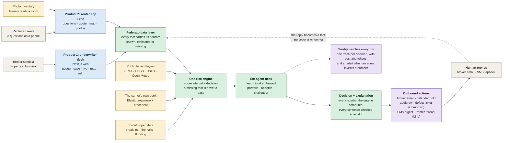
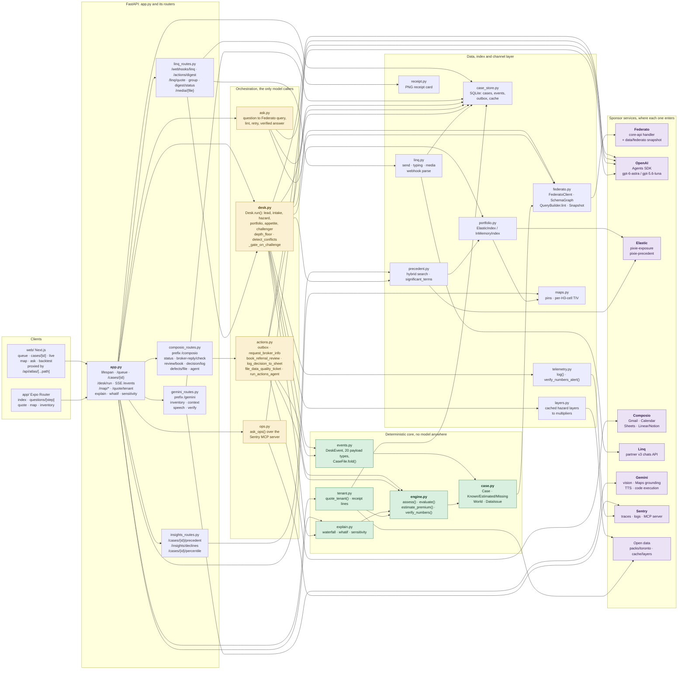
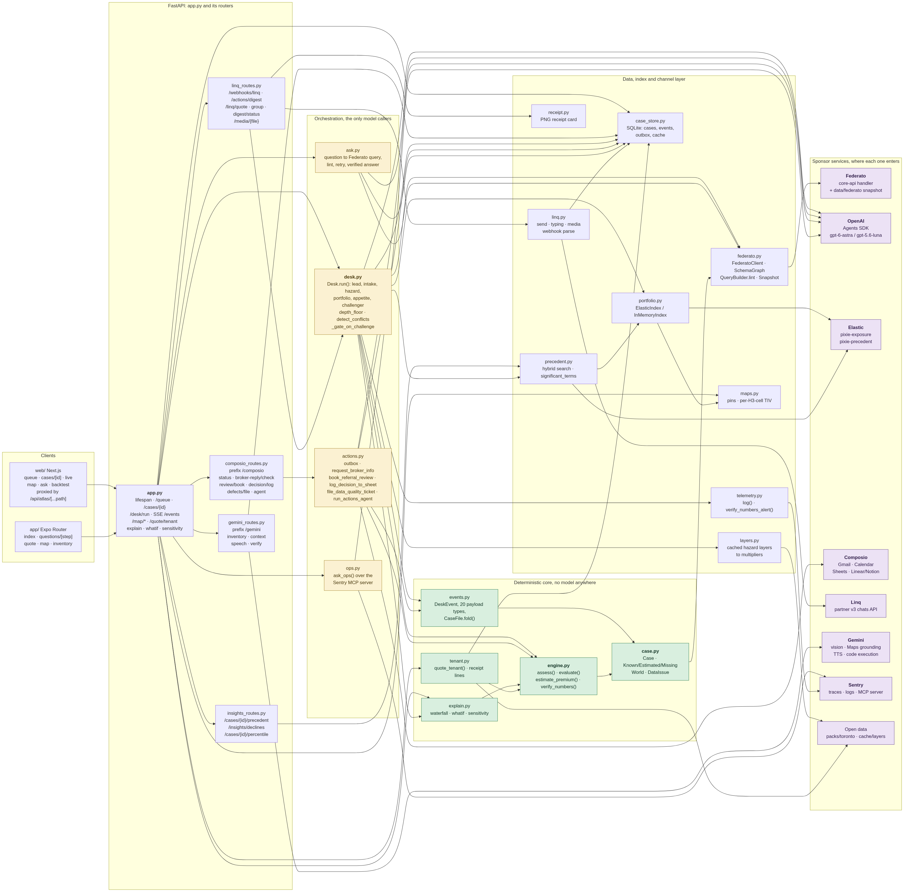
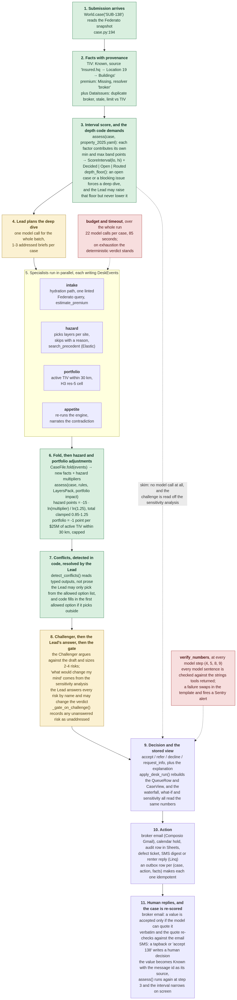

# Pixie architecture

Three pictures. The first is for a judge with 20 seconds, the second is for an engineer reading the
repo, the third follows one submission from arrival to a human reply.

Every box is code that exists in this repo on `lane/a4`. Where a box needs a key or a cluster that
may not be up during the demo, the caption says what runs without it. Nothing planned is drawn.

Rendered copies for a slide or a Devpost post live in `docs/diagrams/` (SVG and PNG, one pair per
diagram). Re-render after editing a block here with:

    python3 scripts/render_diagrams.py      # stdlib only, needs the network once

## 1. What Pixie is

Two products sit on one risk engine. The underwriter desk prices a commercial property submission;
the renter app prices a Toronto tenant policy. The same `assess()` scores both, against a different
rules file.

<!-- diagram: 01-overview -->

What to read off it:

- **Two products, one engine.** `api/src/atlas_api/engine.py:232` `assess()` is called by the
  commercial path (`app.py:95`) and the tenant path (`tenant.py:224`) with different rules files
  (`rules/property_2025.yaml`, `rules/tenant.yaml`).
- **Provenance is the point.** `case.py:36-57` makes every scalar a `Known`, `Estimated` or
  `Missing`. `engine.evaluate()` gives a `Missing` fact every band at once, so a gap widens the
  score interval instead of quietly passing.
- **The score is an interval, not a number.** A case whose interval straddles a threshold is `Open`,
  and the facts that could move it are named with who can supply them (`engine.py:299`).
- **The enrichment is cached.** Hazard layer JSON is read from disk (`layers.py:35`), never fetched
  during a run. The Toronto pack ships its raw GeoJSON in `packs/toronto/raw/`.

## 2. Module map

Modules in `api/src/atlas_api/`, what calls what, and where each sponsor's service enters. An arrow
means "calls into"; several of them are lazy imports inside a route function rather than
module-level ones, which is what keeps importing the app from pulling in the Agents SDK.

<!-- diagram: 02-modules -->

Reading notes:

- `app.py` imports the four routers at module level (`app.py:26-43`) and everything else lazily
  inside the route functions, so importing the app does not pull the OpenAI Agents SDK.
- `composio_routes.py` and `linq_routes.py` import `atlas_api.app` back for `get_store()`,
  `_world` and `apply_desk_run` (`composio_routes.py:37`, `linq_routes.py:40`). That is the one
  cycle in the graph, and it is deliberate: the routers own their own endpoints so lanes editing
  `app.py` do not collide.
- `precedent.py` reuses `portfolio._elastic_client` (`precedent.py:29`), so both indexes share one
  connection check and one silent in-memory fallback.
- Nothing in `engine.py`, `case.py`, `explain.py` or `events.py` imports a model SDK. Every number
  on screen is computed there.

## 3. One case, end to end

The path a single commercial submission takes. Solid arrows are the happy path. Dashed arrows are
the shortcut and the two guards: a decided case skips every model call, the call budget cuts the run
short, and the number check can replace what a model wrote.

```mermaid
flowchart TB
  sub["<b>1. Submission arrives</b><br/>World.case('SUB-138') reads the Federato snapshot<br/>case.py:194"]
  facts["<b>2. Facts with provenance</b><br/>TIV: Known, source 'Insured.hq → Location 19 → Buildings'<br/>premium: Missing, resolver 'broker'<br/>plus DataIssues: duplicate broker, stale, limit vs TIV"]
  triage["<b>3. Interval score, and the depth code demands</b><br/>assess(case, property_2025.yaml): each factor contributes its own<br/>min and max band points → ScoreInterval(lo, hi) + Decided | Open | Routed<br/>depth_floor(): an open case or a blocking issue forces a deep dive,<br/>and the Lead may raise that floor but never lower it"]
  plan["<b>4. Lead plans the deep dive</b><br/>one model call for the whole batch,<br/>1-3 addressed briefs per case"]

  subgraph spec["5. Specialists run in parallel, each writing DeskEvents"]
    direction LR
    intake["<b>intake</b><br/>hydration path, one linted<br/>Federato query, estimate_premium"]
    hazardg["<b>hazard</b><br/>picks layers per site,<br/>skips with a reason,<br/>search_precedent (Elastic)"]
    portfoliog["<b>portfolio</b><br/>active TIV within 30 km,<br/>H3 res-5 cell"]
    appetiteg["<b>appetite</b><br/>re-runs the engine,<br/>narrates the contradiction"]
  end

  fold["<b>6. Fold, then hazard and portfolio adjustments</b><br/>CaseFile.fold(events) → new facts + hazard multipliers<br/>assess(case, rules, LayersPack, portfolio impact)<br/>hazard points = -15 · ln(multiplier) / ln(1.25), total clamped 0.85-1.25<br/>portfolio = -1 point per $25M of active TIV within 30 km, capped"]
  conflict["<b>7. Conflicts, detected in code, resolved by the Lead</b><br/>detect_conflicts() reads typed outputs, not prose<br/>the Lead may only pick from the allowed option list,<br/>and code fills in the first allowed option if it picks outside"]
  challenge["<b>8. Challenger, then the Lead's answer, then the gate</b><br/>the Challenger argues against the draft and sizes 2-4 risks;<br/>'what would change my mind' comes from the sensitivity analysis<br/>the Lead answers every risk by name and may change the verdict<br/>_gate_on_challenge() records any unanswered risk as unaddressed"]
  decision["<b>9. Decision and the stored view</b><br/>accept / refer / decline / request_info, plus the explanation<br/>apply_desk_run() rebuilds the QueueRow and CaseView, and the<br/>waterfall, what-if and sensitivity all read the same numbers"]
  action["<b>10. Action</b><br/>broker email (Composio Gmail), calendar hold, audit row in Sheets,<br/>defect ticket, SMS digest or renter reply (Linq)<br/>an outbox row per (case, action, facts) makes each one idempotent"]
  reply["<b>11. Human replies, and the case is re-scored</b><br/>broker email: a value is accepted only if the model can quote it<br/>verbatim and the quote re-checks against the email<br/>SMS: a tapback or 'accept 138' writes a human decision<br/>the value becomes Known with the message id as its source,<br/>assess() runs again at step 3 and the interval narrows on screen"]

  verify["<b>verify_numbers</b>, at every model step (4, 5, 8, 9)<br/>every model sentence is checked against the strings tools returned;<br/>a failure swaps in the template and fires a Sentry alert"]
  budget["<b>budget and timeout</b>, over the whole run<br/>22 model calls per case, 85 seconds;<br/>on exhaustion the deterministic verdict stands"]

  sub --> facts --> triage --> plan --> spec --> fold --> conflict --> challenge --> decision --> action --> reply
  triage -. "skim: no model call at all, and the<br/>challenge is read off the sensitivity analysis" .-> decision
  budget -.-> spec
  verify -.-> decision

  classDef codeonly fill:#d9efdf,stroke:#2f7d4f,color:#123324
  classDef modelstep fill:#fbf1d2,stroke:#a8862f,color:#4a3a0f
  classDef guard fill:#f7dede,stroke:#a83b3b,color:#4d1414
  class sub,facts,triage,fold,conflict codeonly
  class plan,challenge modelstep
  class verify,budget guard
```

<!-- diagram: 03-decision -->

Where each step lives:

| Step | Code |
| --- | --- |
| 1, 2 | `case.py` `World.case()`, `_tiv_via_policy`, `_infer_business_type`, `_duplicate_and_stale_issues` |
| 3 | `engine.py` `assess()`, `evaluate()`; `desk.py` `depth_floor()` |
| 4, 5 | `desk.py` `Desk._plan()`, `Desk._case()`, `_answer_asks()`, the four tool sets |
| 6 | `events.py` `CaseFile.fold()`, `desk.py` `_CaseRun.enriched()`, `layers.py` `LayersPack`, `portfolio.py` `Impact` |
| 7 | `desk.py` `detect_conflicts()`, `allowed_options()` |
| 8 | `desk.py` `_challenge()`, `_deterministic_challenge()`, `_gate_on_challenge()`; `explain.py` `sensitivity()` |
| 9 | `desk.py` `_decide()`, `_close()`; `app.py` `apply_desk_run()`; `explain.py` `waterfall()`, `whatif()` |
| 10 | `actions.py`, `composio_routes.py`, `linq_routes.py`, `case_store.py` outbox |
| 11 | `actions.py` `check_broker_reply()` / `apply_broker_reply()`, `linq_routes.py` `_dispatch()` |

## What runs with nothing configured

The demo has to survive a dead conference network, so every external call has a recorded or
computed path behind it.

| Missing | What happens |
| --- | --- |
| `ELASTIC_*` | `open_index()` and `open_precedent_index()` fall back to the in-memory index with the same math and the same shape. The desk prints the backend it used, `[elastic]` or `[memory]`. |
| `OPENAI_API_KEY` | `/desk/run` defaults to `mode: "replay"`, which returns the recorded run id and streams the stored events with their original timing, with no model call. Live mode needs the key and fails without it. |
| `ATLAS_OFFLINE=1` | Federato queries answer from `api/cache/federato/q` or say "offline: this query is not in the cache"; `/ask` answers from the store cache only. |
| `ATLAS_ACTIONS` unset (default `dry`) | Every Composio and Linq action composes the message, writes the outbox row and the events, and calls nothing. The repo's own `.env` sets `live`, so on the demo machine they really send. |
| `SENTRY_DSN_API` | `telemetry.log()` is a no-op; the app boots identically. |
| `cache/layers/` empty | Each layer read is a `GapP` event, not a guess. The score simply carries no hazard adjustment. |
| `GEMINI_API_KEY` | The four `/gemini/*` routes return 502 and each client shows an unavailable state. There is no canned Gemini response anywhere, by design: the feature disappears rather than lying. |
| `EXPO_PUBLIC_API_URL` | The Expo app falls back to `app/fixtures/quotes.json` with an "Offline sample" banner, and the photo inventory dead-ends. It is not set in the repo, so it has to be pointed at the tunnel before a demo. |

Two caches carry the demo and neither is in git, because `cache/` and `var/` are in `.gitignore`:
the 350 prefetched hazard layer files (70 locations, five sources) and the Gemini response cache.
Both exist only on the machine that warmed them. `data/federato` is a symlink to a sibling repo, not
content in this one.
