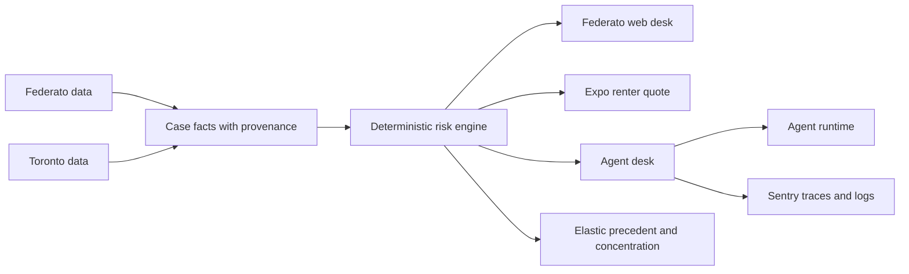

# Architecture

## One engine, two products

`engine.assess()` evaluates both commercial and renter cases. The caller supplies a guideline and facts. Commercial rules live in `rules/property_2025.yaml`; renter rules and pricing context live in the Toronto pack. The engine does not contain city or sponsor names.

The Federato web product is an underwriter workbench. It shows the queue, score interval, source trail, decision waterfall, sensitivity, precedent, portfolio impact, agent events, guideline changes, and bounded overrides.

The Intact web product is a renter operations view. The Expo app collects the address and three underwriting answers, requests a quote, and displays the computed receipt. A referred quote persists as a case that the commercial desk can inspect.

## Decision boundary

Code owns the commercial score, interval, thresholds, receipt arithmetic, and portfolio totals. Models choose investigations, return typed judgments, and write explanations. The number guardrail compares model prose with tool results before the UI receives it.

`Known`, `Estimated`, and `Missing` values preserve provenance. A missing input evaluates across every applicable band, which widens the interval instead of silently treating the input as zero.

## Runtime

FastAPI serves both products. SQLite stores cases, events, and cached provider responses. The Next.js app reads the same case views that the Expo app creates. Elastic has an in-memory fallback with the same response shape. Replay reconstructs an agent run from recorded events and makes no model call.
