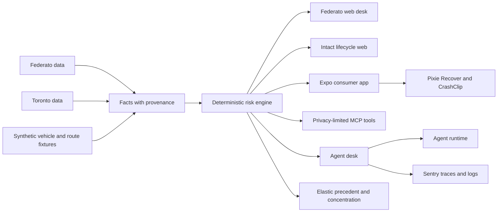

# Architecture

## One engine, two products

engine.assess() evaluates commercial cases and the tenant quote uses the same provenance rules with its own pricing service. Commercial rules live in rules/property_2025.yaml. Tenant pricing and Toronto context live in the Toronto pack. Auto and driving-context demo inputs live in versioned JSON fixtures. Models do not calculate a score or price.

The Federato web product is an underwriter workbench. It shows the queue, score interval, source trail, decision waterfall, sensitivity, precedent, portfolio impact, agent events, guideline changes, and bounded overrides.

The Intact web product is a presentation surface for Quote, Decide, Protect, and Recover. The Expo app is the working consumer product. Home routes to the existing tenant quote, inventory, and prevention flows. Auto routes to vehicle comparison, scenario testing, protection records, driving context, and recovery.

## Consumer service boundary

- POST /quote/home exposes the tenant engine under the Home experience. It rejects homeowner products because no homeowner tariff exists.
- POST /quote/auto and POST /consumer/vehicles/compare use bundled synthetic vehicles and deterministic integer-cent arithmetic.
- POST /quote/scenario combines independently computed tenant and Auto totals without inventing a bundle discount.
- POST /driving/context accepts coarse route points and aggregate driving events. It returns behavior, route-context, and composite coaching scores with provenance. It stores no coordinates and cannot affect a quote or premium.
- Application and recovery routes require consent and a demo confirmation. They prepare unsent records.

## Native Expo surfaces

- Expo Router owns the four-stage navigation and supporting screens.
- @expo/ui supplies native SwiftUI and Jetpack Compose controls in development builds.
- expo-widgets supplies the iOS drive-context widget and Live Activity.
- Expo Go and web use a labelled foreground fallback because native extensions cannot load there.
- The quote and driving flows request location only after an explicit action.

## MCP boundary

- The MCP server imports the same consumer functions as FastAPI.
- It exposes narrow tools for estimates, vehicle comparison, what-if scenarios, application drafts, policy summaries, driving context, and recovery.
- There is no full-profile tool. Policy summaries omit identity, address, contact values, driver licence, and VIN.
- Models call tools and explain their structured results. They do not set prices.

## Decision boundary

- Code owns commercial scores, intervals, thresholds, receipt arithmetic, scenario totals, and driving-context formulas.
- Models choose investigations, return typed judgments, and write explanations.
- Known, Estimated, and Missing values preserve provenance. A missing input evaluates across every applicable band instead of silently becoming zero.
- CrashClip evidence supports recovery and does not decide fault.

## Runtime

- FastAPI serves both products on port 8000. SQLite stores cases, events, and cached provider responses.
- Next.js serves the Federato desk and Intact presentation on port 3100.
- Expo serves the consumer app on port 8081.
- The MCP server uses standard input/output by default and can use Streamable HTTP on port 8010.
- Elastic has an in-memory fallback with the same response shape. Replay reconstructs an agent run from recorded events and makes no model call.
